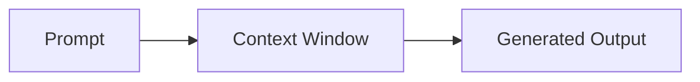

The **context window** is the span of [tokens](/reference/glossary/tokens/) a model
can attend to in a single pass. Exceed it and earlier content falls out of view.

The window is set per tool — see [llama.cpp](/reference/tools/llama-cpp/) for the
relevant flag.

